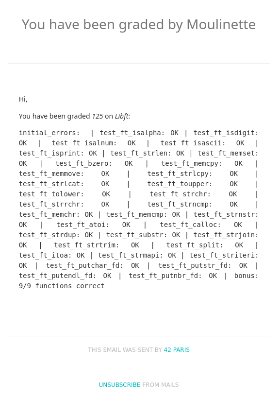

> <span style="font-size:2.5em;">Libft Validation - Effort and Testcases</span>

<!--[42_welcome](42_welcome.png) -->

><span style="font-size:1.75em;">The first **validation**</span>

>Bonus pool announced at 6:42 pm!


It was a busy day throughout , you could feel the tension in the air. There were many eager faces and rare ones rushing and racing to complete their submissions. Most of them 

I don't know  how many of them completed but I managed to complete it despite facing a last minute bug fix for my ft_itoa.

>Can you spot the **bugs**?
```c 
#include "libft.h"
#include <limits.h>
#include <stdlib.h>

// Handles the zero case
static char	*ft_itoa_zero_case(void)
{
	char	*nbr;

	nbr = malloc(2);
	if (!nbr)
		return (NULL);
	nbr[0] = '0';
	nbr[1] = '\0';
	return (nbr);
}

// Returns 1 if negative, 0 if positive
static int	ft_itoa_handle_sign(int n)
{
	if (n < 0)
	{
		return (1);
	}
	else
	{
		return (0);
	}
}

// Counts the number of digits in the absolute value
static int	ft_itoa_count_digits(long n)
{
	int	digits;

	digits = 0;
	if (n == 0)
		return (1);
	while (n)
	{
		n /= 10;
		digits++;
	}
	return (digits);
}

// Allocates the buffer and sets the null terminator
static char	*ft_itoa_prepare_nbr(int digits, int sign)
{
	char	*nbr;

	nbr = malloc(digits + sign + 1);
	if (!nbr)
		return (NULL);
	nbr[digits + sign] = '\0';
	return (nbr);
}

char	*ft_itoa(int n)
{
	long	num;
	int		digits;
	int		sign;
	char	*nbr;
	int		len;

	if (n == 0)
		return (ft_itoa_zero_case());
	num = n;
	sign = ft_itoa_handle_sign(n);
	if (num < 0)
		num = -num;
	digits = ft_itoa_count_digits(num);
	nbr = ft_itoa_prepare_nbr(digits, sign);
	len = digits + sign;
	while (digits > 0)
	{
		nbr[--len] = '0' + (num % 10);
		num /= 10;
		digits--;
	}
	if (sign)
		nbr[0] = '-';
	return (nbr);
}
```
Nerves took over , It has been a year since my last evaluation and most of the people here I don't know them too well yet. Going through 3 rounds of evaluation with 3 different evaluators.


I am proud of the work that I managed to put and the result is a side effect of the effort I have placed in. <span style="font-size:1.75em;"> **Validated!!!**</span>


>Thinking there was a bit more time for extra evaluations , I came in as usual before I even opened up a slot...Guess there's next time.


