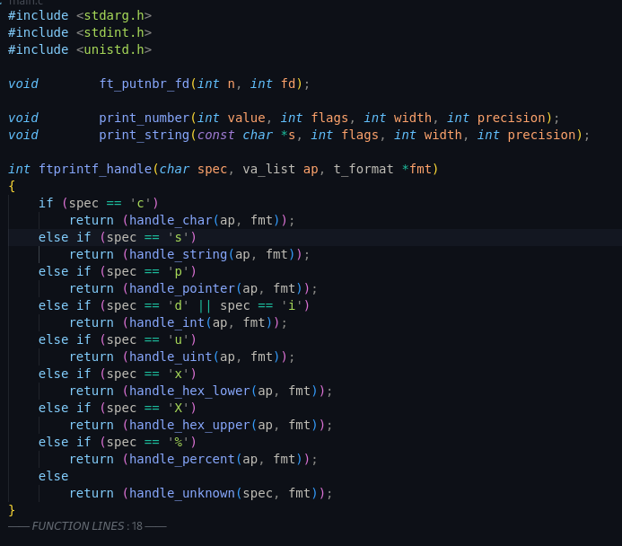

> <span style="font-size:2.5em;">Mandatory Portions of ft_printf (Refactored)</span>

><span style="font-size:1.5em;">Refactoring in process...</span>

This is my 3rd layer of studying of ft_printf , currently refactoring the codes for mandatory submission and am in the midst of implementing helper functions and objects for the **bonus** objective.

I am a bit kinda put-off that the bonus requires a tedious approach to it but this is what I signed up for , committed to my own growth and transformation and therefore the action to do it comes naturally to me.

I don't know if I am putting too much value or respect into reading the thoughts behind the pedagogy of 42. But from what I have seen from the bouns so far , they normally require the extra rigour and effort that has to be forged in fire ,in determination , in frustration , in tears , pushing past my current self, 

Working on the refactored bonus and learning about how I deal with frustration and working through a hard problem.Looking forward to the extended blackhole deadline and validation of this project.

Applying the interleaving techniques to cement my learning , 1 natural way it is done is through the defenses - evaluations that are naturally conducted , another way is recording myself explaining or explaining to fellow colleagues who are still working on the same project and I have enough understanding to relay the information.

I think there maybe 1 or 2 more chapters on ft_printf before I am finished. 

Here's to completing it! To anyone else too who is doing ft_printf and people who come after who are going to work on it as well.


>> 

```c 

```


