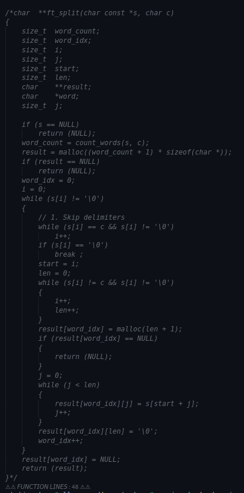

Day 1  - 9 minutes
# Heading 1
## Heading 2

*italic*
**bold**


Below is for unordered list, needs a space between 

List of things that make me ponder today.
- Traffic (distribution)
- Markdown syntax
- Fprintf - vargs[^1]

<!--- comment %}

{% endcomment --->
> Code Block
```

int main() 
{
	return 0;
}

```

Links : [42Singapore] (https://www.42singapore.sg/)

Images : 

Day 2 - 37 minutes


### Block
> Creating a Bockquote
>
> <span style="font-size:3em;">"My balls are big."</span>
>

### Tables
| Feature	| Description	| Example |
|---------------|---------------|---------|
|Able to treat x|WOOWOWOOWOWOWOO|OMMC!	  |


### *Task Lists*
- [x] Tasklists (Checklists) 
- [x] Kolbs - 2 Weeks

### Inline html Snippets 
You can use <span style="color: #e67e22;">inline HTML</span> for extra styling, or add custom elements like  
<details><summary>Click to expand for a surprise!</summary>
🎉 You found the hidden content!
</details>

### Embedding videos and rich media

<!--
Hosted content
<iframe width="420" height="315" src="https://www.youtube.com/embed/dQw4w9WgXcQ"></iframe>
-->

<iframe width="420" height="315" src="https://www.youtube.com/embed/dQw4w9WgXcQ"></iframe>

<!--comment 
Local content


endcomment -->

### 🎯🎯🎯 Emojis 🎯🎯🎯

### Footnotes 

[^1]: Interest during day 1

<!--
In config.toml
[markup]
  [markup.goldmark]
    [markup.goldmark.extensions]
      footnote = true
-->

Day 3 

1. ~~This path is obsolete.~~
Renders as:
This task is obsolete.

Psychological Effect:
❌ Closure & Progress
Strikethrough visually marks completion or cancellation, giving a sense of progress and closure.

2. [TOC]
* [Introduction](#introduction)
* [Features](#features)
* [Conclusion](#conclusion)

Psychological Effect:
🗺️ Sense of Structure & Control
A TOC helps users navigate long documents, reducing anxiety about “getting lost” and increasing the feeling of mastery.

3.  Coding Blocks
 
``` def greet(name): print(f"Hello, {name}!") ``` 

```
def greet(name):
    print(f"Hello, {name}!")
```

Psychological Effect:
🎨 Visual Clarity & Engagement
Syntax highlighting makes code easier to read and understand, reducing cognitive load and boosting confidence for coders.

4. Hidden in a dropdown
<details>
  <summary>Show Solution</summary>
  Here is the hidden solution!
</details>

Psychological Effect:
🔒 Curiosity & Focus
Collapsible sections hide complexity until needed, reducing overwhelm and encouraging exploration.

5. Press `Ctrl+C` to copy.

Renders as:
Press Ctrl+C to copy.

Psychological Effect:
⌨️ Precision & Empowerment
Inline code formatting makes instructions stand out, increasing user confidence and reducing errors.

6. Additional because 5. has been done before.
<pre> ```mermaid graph TD; A-->B; A-->C; B-->D; C-->D; ``` </pre>

Psychological Effect:
🧠 Cognitive Visualization & Comprehension
Visual diagrams help users grasp relationships and processes quickly, improving understanding, memory retention, and engagement17.


Day 4

## 1. **Anchored Links Within a Document**

You can link to any heading in your Markdown by using `[text](#heading-text)`.
This helps readers jump to specific sections, giving them a sense of control and efficiency.

**Sample:**

```markdown
See the [Features section](#features) for more details.
```

## 2. **Mathematical Expressions (LaTeX Math)**

Many Markdown engines (like GitHub, Jupyter, Obsidian) support inline and block math using `$...$` or `$...$`.

**Sample:**

```markdown
The quadratic formula: $x = \frac{-b \pm \sqrt{b^2-4ac}}{2a}$
```
**Psychological Effect:**
🧮 **Cognitive Precision**
Clear math notation reduces ambiguity, increases trust, and supports deeper technical understanding.

---

## 3. **Syntax-Highlighted Code Blocks With Language Tag**

You can specify the language after the triple backticks for syntax highlighting.

**Sample:**

```markdown
```

def greet(name):
print(f"Hello, {name}!")

```
```

**Psychological Effect:**
🎨 **Pattern Recognition \& Learning**
Color-coded syntax helps the brain process and remember code structures faster.

---

## 4. **Callouts/Admonitions**

Some Markdown engines (like Obsidian, GitHub Issues, and Docsify) support callout blocks for tips, warnings, notes, etc.

**Sample:**

```markdown
> [!TIP]
> You can use `Ctrl+F` to quickly search this document.
```

**Psychological Effect:**
💡 **Attention \& Retention**
Visual cues highlight important info, helping users focus and remember key points.
---

## 5. **Task Lists With Progress Bars**

Some platforms (GitHub, Notion, etc.) render task lists with progress bars, giving a visual sense of accomplishment.

**Sample:**

```markdown
- [x] Learn headings
- [x] Learn lists
- [ ] Learn tables
- [ ] Learn advanced Markdown
```

**Psychological Effect:**
✅ **Motivation \& Progress**
Seeing tasks checked off and progress bars fill up triggers dopamine, motivating continued effort.

---

## **Bonus: Sample Table of All Tricks**

| Trick | Syntax Example | Psychological Effect |
| :-- | :-- | :-- |
| Anchored Links | `[link](#section)` | Navigation \& Agency |
| Math Expressions | `$x^2$` | Cognitive Precision |
| Syntax Highlighting | <code>```python ... ``` |  |
| Callouts/Admonitions | `> [!TIP] ...` | Attention \& Retention |
| Task Lists/Progress Bars | `- [x] Task` | Motivation \& Progress |


---
